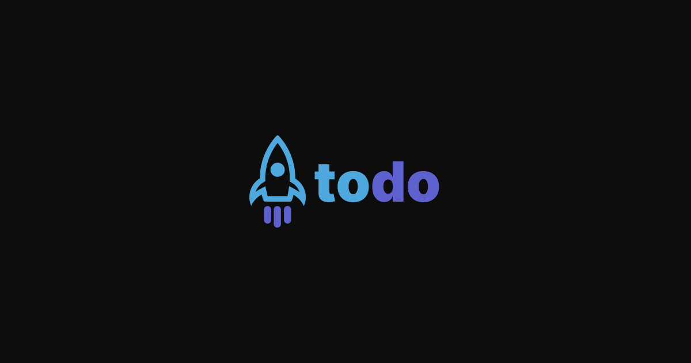

#  ToDo ✔️




---

## 🤔 About

**ToDo**: [Go to ToDo App](https://to-do-app-eoisaac.vercel.app/)

## 📁 Installation

1. Clone the repository:
	```bash
	git clone https://github.com/eoisaac/ToDo_App.git
	```
2. Open the terminal inside the repository, then:

	a. Install dependencies:
	```bash
	npm install
	```
	b. Run:
	```bash
	npm run dev
	```

## 🔧 Technologies

This project was made using the following technologies:
- ViteJS
- ReactJS
- CSS

## 👨‍💻 Author


[Isaac Santiago](https://github.com/eoisaac)

<!-- ## 📝 License

This project has a license, you can access the file to see more details    
[](LICENSE.md) -->

---

[⬆ Back to top](#TypeFast)